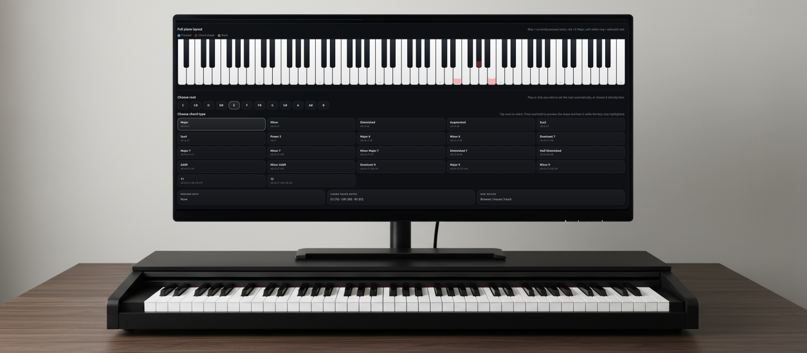
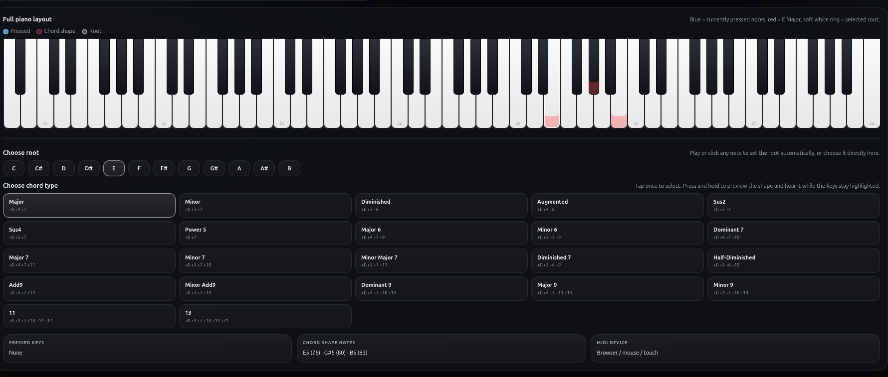

# I/US Music Piano Companion Demo

Web Preview: https://iusmusic.github.io/PianoCompanion/

## Overview

I/US Piano Companion is a self-contained browser app for MIDI note input, chord-shape exploration, piano visualization, note detail display, and lightweight recording/export.

It runs with no backend and no build step. The app uses the Web Audio API for playback, supports Web MIDI input in compatible browsers, and is ready for static hosting on GitHub Pages.

## Core Logic

Core data structures include:

- a single `state` object for audio, MIDI, held notes, active chord selection, preview state, and recording data
- a central `els` object for UI bindings
- lightweight functional sections inside `app.js` for audio, MIDI input, piano rendering, chord preview, recording, and export

## Current Features

- full-width piano keyboard layout in the browser
- live note detection from connected MIDI keyboards in supported browsers
- pressed key highlighting
- displayed note name, MIDI value, and velocity details
- chord-shape suggestions built from the currently played note as root
- tap to select a chord shape
- press and hold chord names to preview sound and shape
- subtle root and chord highlighting on the keyboard
- browser synth playback using Web Audio
- record button for note capture
- MIDI export as a real `.mid` file
- WAV export using `OfflineAudioContext`
- mouse and touch note input fallback
- static hosting compatibility for GitHub Pages
- visual styling aligned with the I/US assistant app aesthetic
- official I/US logo in the top-left header

## Technical Integrations

### Web Audio

Playback is built on the Web Audio API using:

- `AudioContext` for real-time playback
- dual-oscillator synth voicing for quick preview response
- `OfflineAudioContext` for WAV rendering

### Web MIDI

The app uses the Web MIDI API for connected MIDI devices in supported browsers. Incoming note-on and note-off events update the displayed piano and the chord-root state in real time.

## Notes

- Web MIDI works best in Chrome and Edge on desktop.
- Audio begins only after user interaction, which is normal browser behavior.
- The site is static and can be deployed directly to GitHub Pages.
- If a browser does not support Web MIDI, the app still loads and the on-screen keyboard remains usable.

## Trademark and brand notice

**I/US**, **IUS**, and **IUS Music** are protected brand identifiers associated with the official I/US project.

All rights in the **I/US**, **IUS**, and **IUS Music** brand identity are reserved.

## License

This repository is released under the **I/US Music Source-Available License 1.0**.

You may view the code, study it, and use it for private internal evaluation.

You may not sell it, redistribute it, sublicense it, publish modified versions of it, or use it commercially without prior written permission from **PEZHMAN FARHANGI** **I/US Music**.

If this repository is public on GitHub, GitHub users may still have limited rights to view and fork it through GitHub’s own platform functions, as required by GitHub’s Terms of Service.

See `LICENSE.md` and `TRADEMARKS.md` for full terms.
